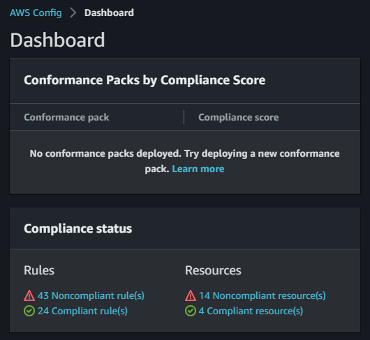
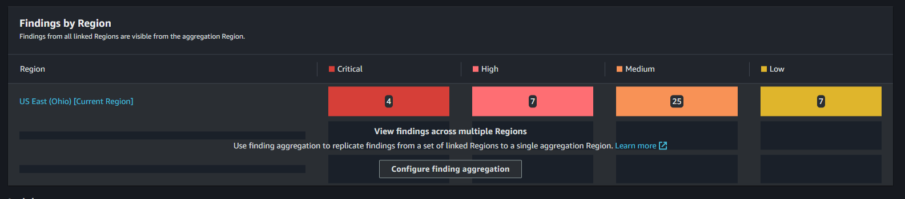
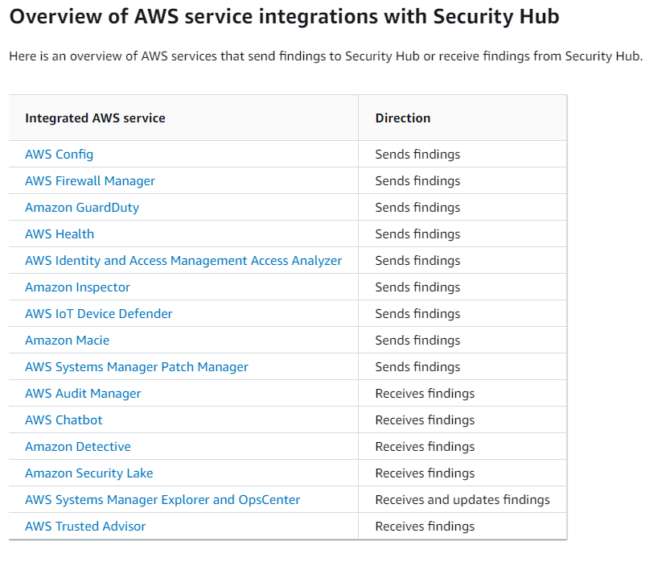

# AWS Security Hub + AWS Config

Using AWS Config rules and getting insights with AWS Security Hub.

Create the resources:

```sh
terraform init
terraform apply -auto-approve
```

👉 Using the Console, enable Security Hub manually.

Give it some time for scanning and check AWS Config:



On Security Hub, check the security posture:



Security Hub can integrate with several other AWS services:


