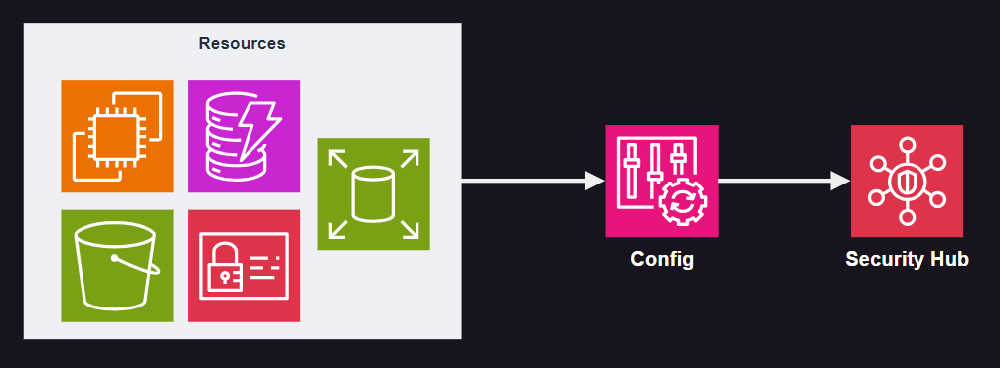
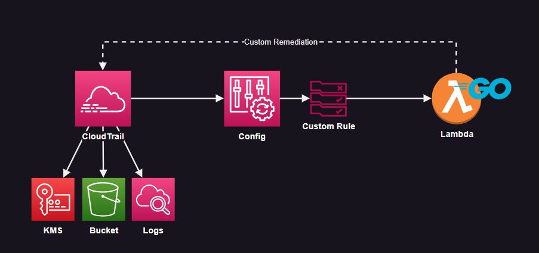
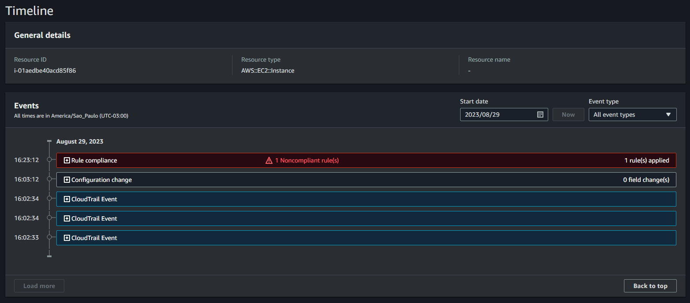
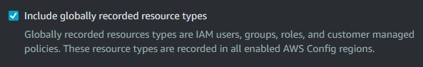
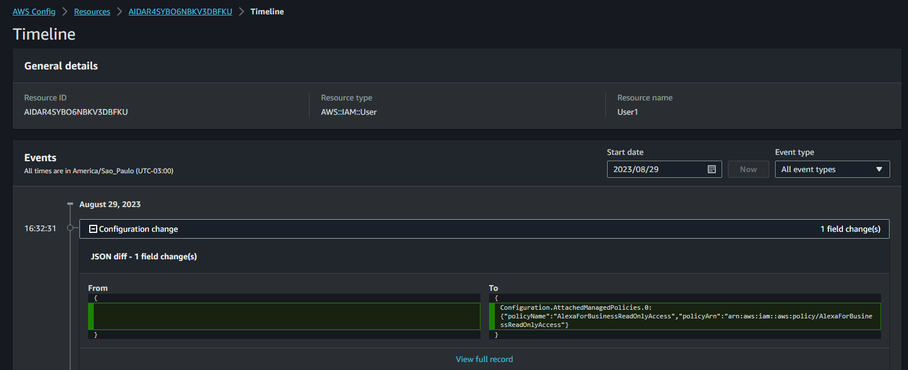

# AWS Security Hub + AWS Config

Using AWS Config rules and getting insights with AWS Security Hub.



Additionally, the code provides a custom rule with Lambda to detect and remediate changes to CloudTrail (or other resources):



Create the resources:

```sh
terraform init
terraform apply -auto-approve
```

👉 Using the Console, enable Security Hub manually.

Give it some time for scanning and check AWS Config:


Make changes to a resource such as the EC2 instance, and check the timeline:



If you enabled Security Hub, check the security posture:


Security Hub can integrate with several other AWS services:


Global recording is enabled ([ref1][1], [ref2][2]):



> Now, you can record changes to the configuration of your IAM Users, Groups, and Roles, including inline policies associated with them. You can also record attachments of your managed (customer-managed) policies and changes made to them.

As well as with other resources, it is possible to track the resource timeline::



## CloudTrail

> ℹ️ For a multi-region trail, must be in the home region of the trail.

> ℹ️ For an organization trail, must be in the master account of the organization.


[1]: https://aws.amazon.com/blogs/security/how-to-record-and-govern-your-iam-resource-configurations-using-aws-config/
[2]: https://aws.amazon.com/about-aws/whats-new/2015/12/now-record-changes-to-iam-users-groups-roles-and-policies-and-write-config-rules-to-check-their-state/
